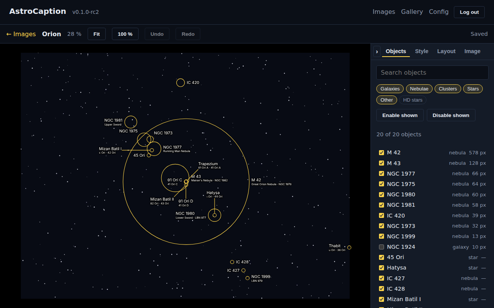
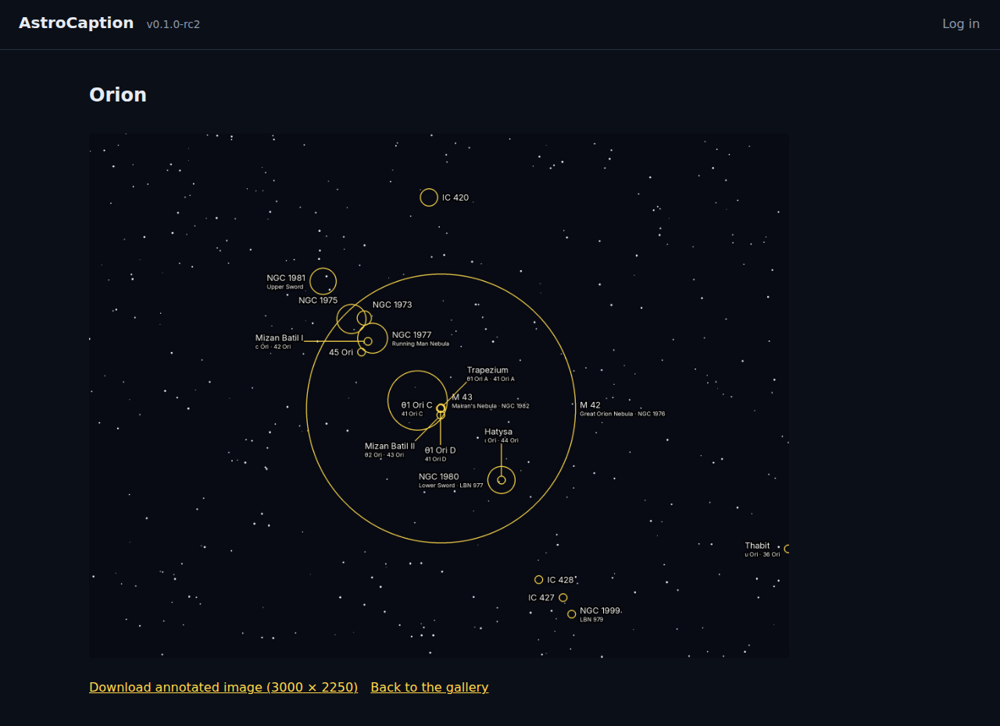

# AstroCaption

Self-hosted web app that plate-solves a **finished, colour-graded** astrophoto (JPG, PNG or
TIFF) with nova.astrometry.net and renders clean, legible annotations onto a full-resolution
copy. Your original file is never modified.

Status: **first release, 0.1.0.** One Docker container, SQLite, a single owner login, and an
optional public gallery. The roadmap is in `docs/SPEC.md` § 13.



## What it does

- **Solve.** Upload the image; a copy at most 3000 px wide goes to nova.astrometry.net under your
  own API key. The catalogue objects nova finds (Messier, NGC, IC, Sharpless, Barnard, Caldwell,
  named stars) come back as positions in your image's own pixels.
- **Annotate.** Every object gets a marker and a label, auto-placed to avoid each other and the
  objects. Then it is yours: turn labels on and off, drag them, pin them, change the font, colours,
  halo and sizes for the image or for one label, re-run the placer, undo.
- **Export.** The server renders the same layout onto a full-resolution copy with Pillow, matching
  the original JPEG's encoding, so the export looks like the browser preview, pixel for pixel
  within a small tolerance that the test suite enforces.
- **Share.** Publish an export to the gallery, a read-only page for visitors; the editor, the
  configuration and unpublished images stay behind the owner login.



## Run it

You need Docker with the compose plugin and a free [nova.astrometry.net](https://nova.astrometry.net)
account for its API key.

```sh
git clone https://github.com/ddovidenko/astrocaption.git && cd astrocaption
docker compose up -d           # pulls ghcr.io/ddovidenko/astrocaption:latest
```

Open <http://localhost:8080>, choose the owner password and paste the API key on the setup page.
Everything the app stores lives in `./data`; back up that directory and nothing else.

- Install, configuration, reverse proxies, upgrades: [`docs/INSTALL.md`](docs/INSTALL.md)
- Locked out: [`docs/LOCKOUT.md`](docs/LOCKOUT.md)
- Product and technical spec: [`docs/SPEC.md`](docs/SPEC.md); code map: [`docs/ARCHITECTURE.md`](docs/ARCHITECTURE.md)
- Questions: [Discussions](https://github.com/ddovidenko/astrocaption/discussions); bugs and solve
  failures: the [issue forms](https://github.com/ddovidenko/astrocaption/issues/new/choose)

## Develop

[](https://codespaces.new/ddovidenko/astrocaption)

`make install && make dev` on a machine with Python 3.13+ and Node 24, or open the repo in a
Codespace, which does the same. `make test`, `make lint` and `make e2e` are the checks CI runs;
`docs/ARCHITECTURE.md` says where things are.

## Licence

MIT. Bundled fonts carry their own open-font licences in `fonts/LICENSES/` (OFL, and the Ubuntu
Font Licence for Ubuntu); the object-name table in `backend/app/catalog/names.json` is derived
from [OpenNGC](https://github.com/mattiaverga/OpenNGC) under CC BY-SA 4.0 (see
`backend/app/catalog/OPENNGC-LICENSE.md`). Plate solving is a service of
[astrometry.net](https://astrometry.net); every solve uploads a reduced copy of your image to
your nova account.
